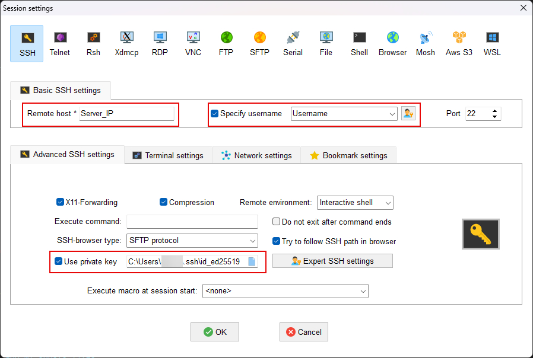

# How to Connect to a Server Using SSH Keys

Connecting to a server via SSH keys is a highly secure and convenient alternative to password-based authentication. Once set up, you can log in without a password, and you significantly boost your server's security.

This guide will walk you through the entire process, step by step.

### 🚀 The Overall Process

1.  **On your Client machine:** Generate a pair of cryptographic keys (one public, one private).
2.  **On your Server:** Add your public key to the list of authorized keys.
3.  **Connect:** Your client will use its private key to prove its identity, and the server will verify it using the stored public key.

---

## Step 1: Generate SSH Keys on Your Client Machine 💻

First, you need to create a key pair on your local computer.

*   **Private Key:** This file is your secret. It must **never** be shared and should remain securely on your computer. Think of it as the key to your safe.
*   **Public Key:** This file is shareable. You'll place it on any server you want to access. Think of it as the lock for your safe that you can give to others.

### Instructions:

1.  Open your terminal (on Linux/macOS) or PowerShell/Git Bash (on Windows).

2.  Run the following command to generate a new key pair.

    ```bash
    ssh-keygen -t ed25519 -C "Comment"
    ```

    *   `ssh-keygen`: The command-line tool to create keys.
    *   `-t ed25519`: Specifies the key algorithm. `Ed25519` is modern, fast, and highly secure, making it the recommended choice today. (An older alternative is `rsa`).
    *   `-C "Comment"`: A comment to help you identify the key later. Using your email is a common convention.

3.  The tool will then ask you a few questions:

    *   `Enter file in which to save the key (...)`: Press **Enter** to accept the default location (`~/.ssh/id_ed25519`).
    *   `Enter passphrase (empty for no passphrase)`: This is an extra layer of security. If someone gains access to your private key file, they still won't be able to use it without this passphrase. **It is highly recommended to set a strong passphrase.**
    *   `Enter same passphrase again`: Confirm your passphrase.

After this, two files will be created in your `~/.ssh` (Linux OS) or `C:\Users\$USERNAME\.ssh` (Windows OS) directory:
*   `id_ed25519` (your private key)
*   `id_ed25519.pub` (your public key)

---

## Step 2: Copy Your Public Key to the Server ☁️

Now, you need to tell your server about your public key so it can trust your client machine.

### Method 1: The Easy Way (Using `ssh-copy-id`)

If your client machine has the `ssh-copy-id` utility, this is the simplest method.

1.  Run the following command in your local terminal. Replace `user` with your username on the server and `server_ip_address` with your server's IP.

    ```bash
    ssh-copy-id user@server_ip_address
    ```

2.  You will be prompted for your **server user's password** (this should be the last time you need it!).

This command automatically appends your public key to the `~/.ssh/authorized_keys` file on the server and sets the correct directory and file permissions.

### Method 2: The Manual Way

If you don't have `ssh-copy-id`, you can perform the steps manually.

1.  **On your client machine**, display and copy the content of your public key:

    ```bash
    cat ~/.ssh/id_ed25519.pub
    ```

    Select and copy the entire output, which starts with `ssh-ed25519...`.

2.  **Log in to your server** using your current password-based method:

    ```bash
    ssh user@server_ip_address
    ```

3.  **On the server**, run the following commands:

    ```bash
    # Create the .ssh directory if it doesn't exist and set its permissions.
    mkdir -p ~/.ssh
    chmod 700 ~/.ssh

    # Paste your public key into the authorized_keys file.
    # Replace 'PASTE_YOUR_PUBLIC_KEY_HERE' with the key you copied.
    echo 'PASTE_YOUR_PUBLIC_KEY_HERE' >> ~/.ssh/authorized_keys

    # Set the file permissions to be secure.
    chmod 600 ~/.ssh/authorized_keys
    ```

    > **Note:** Correct permissions are crucial. SSH will ignore the `authorized_keys` file if its permissions are too open. `700` for `~/.ssh` and `600` for `~/.ssh/authorized_keys` are required.


    Open the SSH daemon configuration file with a text editor (e.g., `nano`):**

    ```bash
    sudo nano /etc/ssh/sshd_config
    ```

    Apply this Changes:
    ```bash
    #PermitRootLogin prohibit-password ==> PermitRootLogin yes

    #PubkeyAuthentication yes ==> PubkeyAuthentication yes

    #AuthorizedKeysFile      .ssh/authorized_keys .ssh/authorized_keys2 ==> AuthorizedKeysFile      .ssh/authorized_keys .ssh/authorized_keys2 
    ```
    ****Note:**** Restart SSH Service
    ```bash
    service sshd restart
    ```
---

## Step 3: Log In to Your Server! 🎉

You're all set! Log out of the server (`exit`) and try connecting again from your client machine.

```bash
ssh user@server_ip_address
```

This time, you won't be asked for your server password. Instead, you'll be prompted for the **key's passphrase** you created in Step 1. Enter it, and you're in!

---
## Optional Step : Log In to Your Server! (Using MobaXterm Application) 🎉

Add Your Private Key in your session on MobaXterm Application



---

## Advanced Tips & Best Practices 💡

### Disable Password Authentication

For maximum security, you should disable password authentication on your server entirely after confirming your key-based login works. This prevents brute-force password attacks.

1.  SSH into your server.
2.  Open the SSH daemon configuration file with a text editor (e.g., `nano`):
    ```bash
    sudo nano /etc/ssh/sshd_config
    ```
3.  Find the line `PasswordAuthentication` and change its value to `no`:
    ```
    PasswordAuthentication no
    ```
4.  Save the file and exit the editor.
5.  Restart the SSH service to apply the changes:
    ```bash
    sudo systemctl restart sshd
    ```

> ⚠️ **Warning:** Before you do this, make **absolutely sure** your SSH key login is working correctly. If it's not, you could lock yourself out of your server!

### Use an `ssh-agent` to Avoid Retyping Your Passphrase

An SSH agent can store your decrypted private key in memory, so you only have to enter your passphrase once per session.

1.  Start the agent:
    ```bash
    eval "$(ssh-agent -s)"
    ```
2.  Add your SSH key to the agent:
    ```bash
    ssh-add ~/.ssh/id_ed25519
    ```

Now, for the rest of your terminal session, you can SSH into your server without entering your passphrase.
